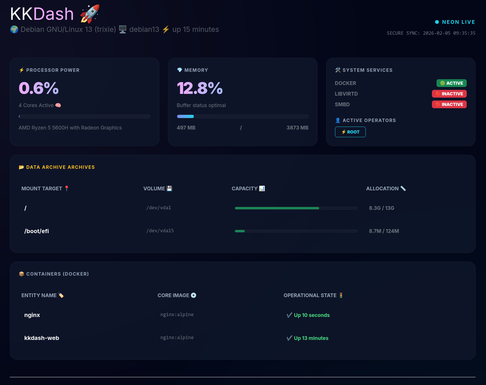

# 🚀 KKDash - Lightweight Linux System Dashboard



KKDash is a lightweight and fast dashboard for Linux systems, designed to display basic system state information in a modern and clear way. Perfect for those who need a quick overview of system parameters without heavy resource usage. ⚡

## ✨ Key Features

- ⚡ **CPU Monitor**: Real-time CPU usage overview along with model and core count.
- 💎 **Memory Management**: Clear RAM usage status.
- 🛠️ **System Services**: Status overview of key system services.
- 📂 **Data Archives**: Information about mounted file systems and available space.
- 📦 **Docker Containers**: List of running containers and their status. *(Hidden if Docker is not installed on the system)*
- � **Firewall Intelligence (UFW)**: Statistics on blocked traffic, including top attacking IPs and target port distribution. Includes quick RIPE database lookup links (🔍). *(Auto-hidden if UFW is inactive)*
- �👤 **Active Operators**: Overview of users currently logged into the system.
- ⏱️ **System Uptime**: Information on how long the system has been running.


## 🛠️ Installation

To install KKDash as a system service, follow these steps (requires root/sudo privileges):

1. **Clone github repo and run the installation script**:
   ```bash
   sudo ./setup_service.sh install
   ```

The script automatically:
- Creates the `/opt/kkdash/bin` (for logic) and `/opt/kkdash/www` (for web files) directories.
- Copies project files to appropriate locations.
- Checks for Python 3 presence.
- Sets up and starts a `systemd` service named `kkdash.service`.

### Upgrade

If you have made changes to `monitor.py`, `index.html`, or `style.css` and want to apply them to the installed version, run:
```bash
sudo ./setup_service.sh upgrade
```
This command copies the updated files to `/opt/kkdash/bin` and `/opt/kkdash/www` and restarts the service.

### Uninstallation

To completely remove KKDash and its service, run:
```bash
sudo ./setup_service.sh uninstall
```

## ⚙️ Configuration

You can customize the data update frequency by modifying the `monitor.py` file:

1. Open `monitor.py`.
2. Change the values to your preferred settings:
   ```python
   REFRESH_INTERVAL = 5  # Refresh interval in seconds
   CHECK_SERVICES = ["docker", "libvirtd"]  # Services to monitor
   ```
3. Restart the service to apply changes: `sudo systemctl restart kkdash`.

## 🌐 Web Interface Deployment

The `/opt/kkdash/www` directory contains static files and a `data.json` file generated every 5 seconds. To view the dashboard in your browser, you need to serve this directory using a web server.

### 🐳 Option A: Docker (Recommended)

The fastest way to run the interface using a lightweight Nginx image:

```bash
# via docker
sudo docker run -d \
  --name kkdash-web \
  --restart always \
  -v /opt/kkdash/www:/usr/share/nginx/html:ro \
  -p 8080:80 \
  nginx:alpine

# or via docker compose
cd  /opt/kkdash && docker compose up -d
```
The dashboard will be available at: `http://localhost:8080`

### 🏗️ Option B: Traditional Web Server (Apache/Nginx)

If you prefer a traditional approach, configure your web server to serve files from the `/opt/kkdash/www` directory. Remember to grant appropriate read permissions to the web server user.

---
* 📄 License: GPL-3.0 license.
* 🙌 Author: Kamil Kobak
* 🐧Open Source > Everything


